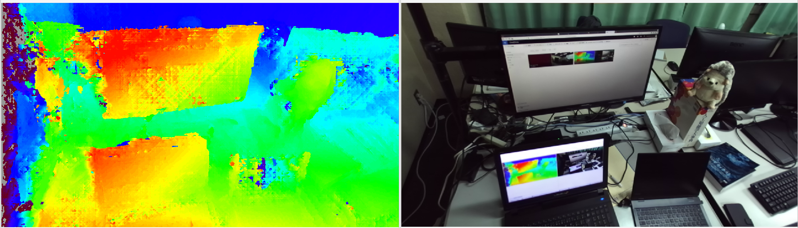

# diparity_visualize

`diparity_visualize` is a ROS package and contains a nodelet to visualize [stereo_msgs/DisparityImage](http://docs.ros.org/api/stereo_msgs/html/msg/DisparityImage.html) .

This is based on and similar to [disparity_view in image_view](http://wiki.ros.org/image_view) , but there are some difference:
- Output is ROS topic instead of OpenCV window
- [HSV color map](https://docs.opencv.org/3.4/d3/d50/group__imgproc__colormap.html#gga9a805d8262bcbe273f16be9ea2055a65a141ad9bfece7aa670ff3bddd38fac98e)

## diparity_visualize/diparity_visualize

A nodelet visualizes [stereo_msgs/DisparityImage](http://docs.ros.org/api/stereo_msgs/html/msg/DisparityImage.html) as RGB [sensor_msgs/Image](http://docs.ros.org/api/sensor_msgs/html/msg/Image.html) .

Disparity at each pixel is normalized by `DisparityImage/min_disparity` and `max_disparity` , and then colored by [HSV color map](https://docs.opencv.org/3.4/d3/d50/group__imgproc__colormap.html#gga9a805d8262bcbe273f16be9ea2055a65a141ad9bfece7aa670ff3bddd38fac98e) .
Pixels out of `[min_disparity, max_disparity]` are treated as invalid and colored by black.

### Subscribed topic

- `disparity` ( [stereo_msgs/DisparityImage](http://docs.ros.org/api/stereo_msgs/html/msg/DisparityImage.html) )
  
  Input disparity image.

### Published topic

- `image` ( [sensor_msgs/Image](http://docs.ros.org/api/sensor_msgs/html/msg/Image.html) )
  
  RGB image visualizes disparity.
